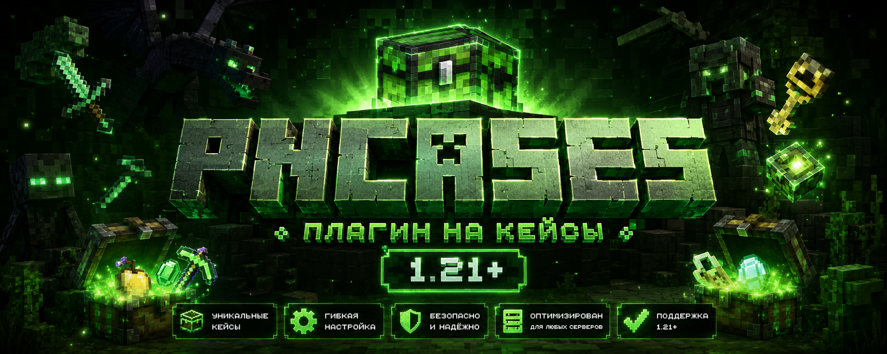

  

  
  
  
  

<h1 align="center">pnCases 1.4.6 GlobalVersion</h1>

  Бесплатный плагин кейсов для Paper и Purpur 1.19 - 1.21.11.
  Красивые анимации, GUI, preview наград, история открытий, голограммы, SQLite, LuckPerms, Vault и PlayerPoints.

  <b>Полное оформление, команды, награды, анимации, примеры конфигов и установка находятся на сайте:</b> 
  <a href="https://dy6hila.github.io/pnCases/">https://dy6hila.github.io/pnCases/</a>

<table>
  <tr>
    <td width="33%">
      <h3>Версии</h3>
      
Paper/Purpur 1.19 - 1.21.11 Java 17+

    </td>
    <td width="33%">
      <h3>Хранилище</h3>
      
SQLite для ключей, истории, настроек игроков и pending-наград.

    </td>
    <td width="33%">
      <h3>Награды</h3>
      
Предметы, LuckPerms, Vault и PlayerPoints.

    </td>
  </tr>
</table>

## Быстрый старт

1. Скачайте [`pnCases-1.4.6.jar`](https://github.com/Dy6HiLa/pnCases/releases/download/v1.4.6/pnCases-1.4.6.jar).
2. Положите файл в папку `plugins/`.
3. Перезапустите сервер.
4. Настройте `plugins/pnCases/config.yml`, `messages.yml` и файлы в `plugins/pnCases/cases/`.

## Команды

| Команда | Описание |
|---|---|
| `/pncases` | Единое меню: версия, обновление, поддержка и команды |
| `/pncases reload` | Перезагрузить настройки |
| `/pncases machine <кейс>` | Настроить кейс через GUI |
| `/pncases setcase <кейс>` | Поставить кейс на блок |
| `/pncases delcase <кейс>` | Убрать блоки кейса |
| `/pncases givekey <игрок> <ключ> <кол-во>` | Выдать ключи |
| `/pncases takekey <игрок> <ключ> <кол-во>` | Забрать ключи |

## Ссылки

- Сайт: [dy6hila.github.io/pnCases](https://dy6hila.github.io/pnCases/)
- Релиз: [pnCases 1.4.6 GlobalVersion](https://github.com/Dy6HiLa/pnCases/releases/tag/v1.4.6)
- Скачать: [pnCases-1.4.6.jar](https://github.com/Dy6HiLa/pnCases/releases/download/v1.4.6/pnCases-1.4.6.jar)
- Архив изменений: [docs/releases](docs/releases/)
- Поддержка: [Discord](https://discord.gg/rRbzq6cnc6)
