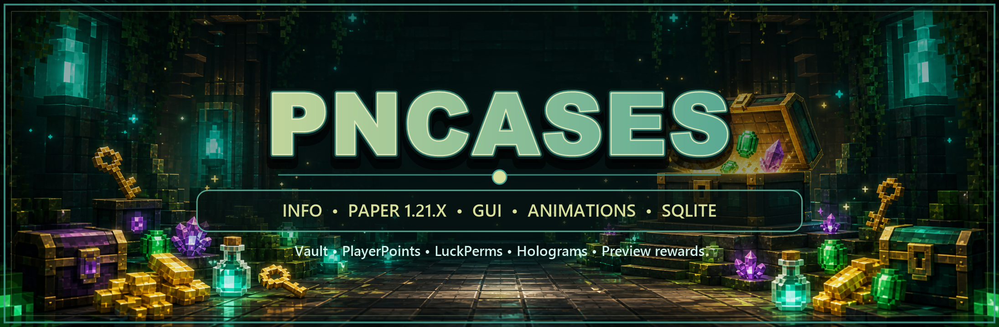

<p align="center">
  <a href="https://github.com/Dy6HiLa/pnCases/releases/tag/v1.4.6">
    
  </a>
</p>

<p align="center">
  <a href="https://github.com/Dy6HiLa/pnCases/releases/download/v1.4.6/pnCases-1.4.6.jar">
    
  </a>
  <a href="https://github.com/Dy6HiLa/pnCases/releases/tag/v1.4.6">
    
  </a>
  <a href="LICENSE">
    
  </a>
</p>

# pnCases

`pnCases` - бесплатный плагин кейсов для Paper 1.19 - 1.21.11 с анимациями, GUI, историей открытий, preview наград, голограммами, LuckPerms, Vault и PlayerPoints-наградами.

## pnCases 1.4.6 GlobalVersion

`1.4.6 GlobalVersion` - обновление совместимости. pnCases теперь собирается как Java 17 jar, имеет `api-version: 1.19` и рассчитан на запуск на Paper/Purpur `1.19 - 1.21.11`.

Что нового:

- Добавлена проверка версии сервера при запуске: ниже 1.19 плагин аккуратно отключится с понятным сообщением.
- Для 1.21+ оставлены полноценные красивые анимации pnCases.
- Для 1.19-1.20 добавлен совместимый режим анимаций, чтобы кейсы открывались без падений из-за новых display/particle API.
- Витрина кейса переведена на более безопасный визуальный слой и не зависит от `ItemDisplay`.
- Голограммы выбираются через FancyHolograms или DecentHolograms без обязательного TextDisplay fallback.
- Команда `/pncases` теперь показывает единое красивое сообщение: версия, статус обновления, поддержка и список команд в одном месте.

Что изменилось внутри:

- Сборка переведена на Java 17 bytecode.
- `api-version` изменён на `1.19`, чтобы один JAR можно было запускать на версиях ниже 1.21.
- Для старых версий добавлены безопасные варианты материалов, частиц и GUI-подсветки.

## Предыдущие версии

Старые списки изменений вынесены в [архив релизов](docs/releases/), чтобы главная страница не смешивала новую версию с прошлыми hotfix-описаниями.

## Установка

1. Скачайте `pnCases-1.4.6.jar`.
2. Положите файл в папку `plugins/`.
3. Перезапустите сервер.
4. Настройте `plugins/pnCases/config.yml` и `messages.yml`.

Зависимости:

- Paper/Purpur 1.19 - 1.21.11 - обязательно.
- LuckPerms - опционально, для выдачи групп и прав.
- Vault - опционально, для денежных наград.
- PlayerPoints - опционально, для поинтовых наград.
- FancyHolograms - опционально, для голограмм на новых версиях.
- DecentHolograms - опционально, для голограмм на старых версиях.

## Команды

| Команда | Описание |
|---|---|
| `/pncases` | Показать список команд, версию и статус обновления |
| `/pncases reload` | Перезагрузить `config.yml` и `messages.yml` |
| `/pncases setcase <кейс>` | Добавить этот кейс на блок, на который вы смотрите |
| `/pncases delcase <кейс>` | Убрать все блоки этого кейса без удаления настроек |
| `/pncases givekey <игрок> <ключ> <кол-во>` | Выдать ключи |
| `/pncases takekey <игрок> <ключ> <кол-во>` | Забрать ключи |

Право администратора:

```yaml
pncases.admin
```

## Пример наград

`type: ITEM` выдает предмет игроку:

```yaml
rewards:
  - chance: 45
    rarity: COMMON
    type: ITEM
    item:
      material: DIAMOND
      amount: 8
      name: '&bАлмазы &8x8'
```

`type: VAULT`, `PLAYERPOINTS` и `LUCKPERMS` используют `visual:` только для отображения в GUI и анимациях:

```yaml
rewards:
  - chance: 30
    rarity: RARE
    type: VAULT
    vault:
      amount: 2500
    visual:
      material: GOLD_INGOT
      name: '&e2500 монет'
    message: '&aВы получили &f{amount}&a на баланс!'
```

## Анимации

Игрок выбирает анимацию через GUI кейса. Выбор сохраняется в SQLite.

На 1.21+ используется полный визуальный режим. На 1.19-1.20 включается совместимый режим открытия, чтобы кейсы стабильно работали на старых версиях.

| Анимация | Описание |
|---|---|
| Наковальня | Падение наковальни и появление награды |
| Динамит | Полет TNT, взрыв и выдача награды |
| Портал | Эффекты портала и появление приза |
| Отравление | Ядовитый слайм, частицы и награда |
| Астральный разлом | Магический разлом с вращением наград |

Настройка направления слайма для Отравления:

```yaml
animation:
  poison:
    slime-facing: PLAYER # NORTH / SOUTH / EAST / WEST / PLAYER / число yaw
    slime-pitch: 0
```

## Витрина Кейса

Витрина показывает предмет над свободным кейсом. Предмет можно выбрать в `/pncases machine`, а эффекты вокруг него можно оставить или выключить.

```yaml
idle-particles:
  enabled: true        # вся витрина
  effects: true        # только эффекты вокруг предмета
  style: AURORA
  theme: MAGIC
  interval_ticks: 2
  radius: 0.85
  height: 1.35
  speed: 0.14
  view_distance: 28
  item:
    material: NETHER_STAR
    name: "&aДонат кейс"
```

## Голограммы

```yaml
hologram:
  enabled: true
  type: TEXT
  y: 1.5
  lines:
    - "&a&lДонат кейс"
    - "&7ПКМ, чтобы открыть"
```

pnCases выбирает доступный провайдер голограмм автоматически: FancyHolograms или DecentHolograms. Если ни один плагин голограмм не установлен, кейсы продолжают работать без голограммы.

## Обновления

Проверка обновлений работает через GitHub и не требует настройки в `config.yml`.

pnCases проверяет:

- `update-manifest.json`;
- последний GitHub Release;
- git tags;
- версию в `plugin.yml`.

Если найдена версия выше установленной, админы с `pncases.admin` увидят сообщение со ссылкой на скачивание.

## Файлы

```text
plugins/pnCases/
├── config.yml
├── messages.yml
└── data.db
```

Старые YAML-файлы данных мигрируются в SQLite автоматически.

## Документация

- [Архив релизов](docs/releases/)

## Поддержка

Пишите идеи, баги и предложения. Чем больше актива и обратной связи, тем быстрее будут выходить новые обновления.
