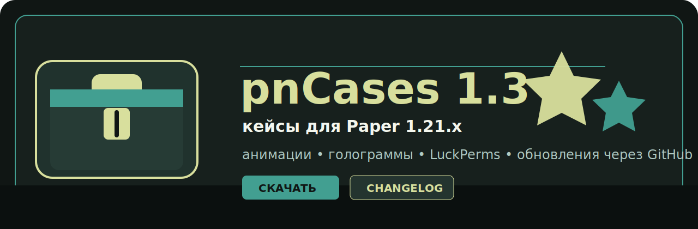

<p align="center">
  
</p>

# pnCases

`pnCases` - бесплатный плагин кейсов для Paper 1.21.x с красивыми анимациями, GUI, историей открытий, голограммами и LuckPerms-наградами.

[Скачать pnCases 1.3](https://github.com/Dy6HiLa/pnCases/raw/master/release/pnCases-1.3.jar)

## pnCases 1.3

Извините за столь долгое ожидание. В версии `1.3` плагин стал удобнее, красивее и стабильнее. Если будет еще больше актива и обратной связи, обновлений будет еще больше.

Что нового:

- Вернули выбор анимации открытия: Наковальня, Динамит, Портал и Отравление.
- Добавили красивое GUI-меню выбора анимации.
- Добавили отдельные тихие звуки для каждой анимации.
- Добавили историю последних открытий прямо в GUI кейса.
- Исправили отображение донат-наград: теперь каждая награда может иметь свой `base64`.
- Улучшили broadcast после открытия кейса.
- Добавили красивые уведомления об обновлениях с кликабельной ссылкой на скачивание.
- Добавили fallback-голограммы через `TextDisplay`, если FancyHolograms недоступен.
- Добавили настройку направления слайма для анимации Отравление.
- Убрали лишние Discord/metrics/bStats-связки.

## Установка

1. Скачайте `pnCases-1.3.jar`.
2. Положите файл в папку `plugins/`.
3. Перезапустите сервер.
4. Настройте `plugins/pnCases/config.yml` и `messages.yml`.

Зависимости:

- Paper 1.21.x - обязательно.
- LuckPerms - опционально, для выдачи групп/прав.
- FancyHolograms - опционально, если нужны голограммы через этот плагин. Без него pnCases умеет создавать fallback-голограммы через `TextDisplay`.

## Команды

| Команда | Описание |
|---|---|
| `/pncases` | Показать список команд |
| `/pncases reload` | Перезагрузить config.yml и messages.yml |
| `/pncases setcase <кейс>` | Привязать кейс к блоку |
| `/pncases givekey <игрок> <ключ> <кол-во>` | Выдать ключи |
| `/pncases takekey <игрок> <ключ> <кол-во>` | Забрать ключи |

Право администратора:

```yaml
pncases.admin
```

## Пример настройки ключей

```yaml
keys:
  donate_key:
    name: '&aДонат кейс'
  tools_key:
    name: '&aКлюч: &fИнструменты'
```

## Пример награды с base64

Для донат-наград можно указать отдельный визуальный предмет. Он будет показан в анимации и не будет заменяться первым предметом из `animation.items`.

```yaml
rewards:
  - chance: 25
    type: LUCKPERMS
    item:
      base64: "eyJ0ZXh0dXJlcyI6..."
      name: "&aRanger"
    luckperms:
      group: ranger
      display_name: "&aRanger"
    message: "&aТы получил привилегию Ranger!"
```

## Анимации

Игрок выбирает анимацию через GUI кейса. Выбор сохраняется в `player_prefs.yml`.

| Анимация | Описание |
|---|---|
| Наковальня | Падение наковальни и появление награды |
| Динамит | Полет TNT, взрыв и выдача награды |
| Портал | Эффекты портала и появление приза |
| Отравление | Ядовитый слайм, частицы и награда |

Настройка направления слайма для Отравления:

```yaml
animation:
  poison:
    slime-facing: PLAYER # NORTH / SOUTH / EAST / WEST / PLAYER / число yaw
    slime-pitch: 0
```

## Голограммы

```yaml
hologram:
  enabled: true
  type: TEXT
  y: 1.5
  lines:
    - "&a&lДонат кейс"
    - "&7ПКМ, чтобы открыть"
```

Если FancyHolograms установлен, pnCases попробует использовать его. Если нет или API не подошел, будет создан обычный `TextDisplay`.

## Обновления

Проверка обновлений работает через GitHub и не требует настройки в `config.yml`.

pnCases проверяет:

- `update-manifest.json`;
- последний GitHub Release;
- git tags;
- версию в `plugin.yml`.

Если найдена версия выше установленной, админы с `pncases.admin` увидят красивое сообщение с кликабельной ссылкой на скачивание.

## Файлы

```text
plugins/pnCases/
├── config.yml
├── messages.yml
├── keys.yml
├── open_history.yml
├── pending_rewards.yml
└── player_prefs.yml
```

## Поддержка

Пишите идеи, баги и предложения. Чем больше актива, тем быстрее будут выходить новые обновления.
